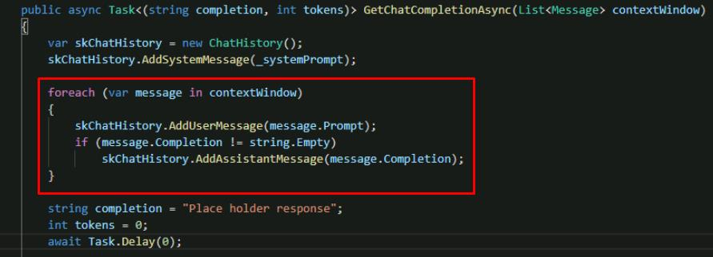
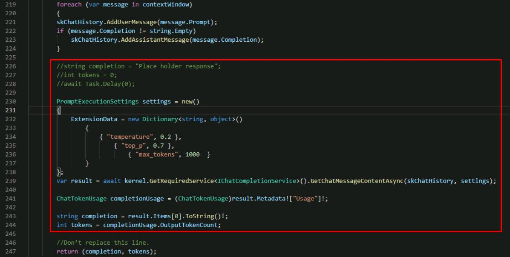
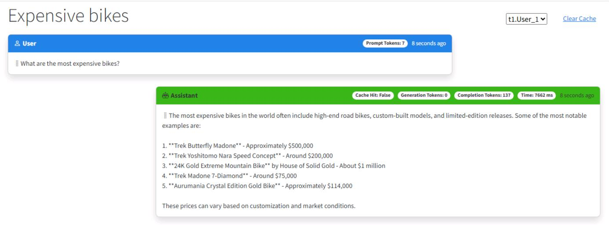

# Task 02: Implement the Semantic Kernel

### Introduction
CWBC’s Intelligent Assistant must provide quick, intelligent responses for users asking about bike models, maintenance, and route tips. By integrating Semantic Kernel, you’ll orchestrate calls to Azure OpenAI, turning the placeholders into real completions—key to meeting CWBC’s advanced customer-service goals.

### Description
In this exercise, you'll implement the Semantic Kernel Service to generate real responses from Azure OpenAI. 

Semantic Kernel is an open-source SDK for LLM orchestration created by Microsoft Research. It lets you easily build agents that can call your existing code. As a highly extensible SDK, you can use Semantic Kernel with models from OpenAI, Azure OpenAI, Hugging Face, and more! You can also connect it to various vector databases using built-in connectors, including Azure Cosmos DB. 

By combining your existing code with these models, you can build agents that answer questions and automate processes.

### Success Criteria
 - Placeholder responses are replaced with real GPT outputs from Azure OpenAI.
 - The application still compiles and runs smoothly, confirming your Semantic Kernel integration is correct.


### Learning Resources
 - TBD

## Key Tasks


### 01: Add the OpenAI Chat Completion extension

<details markdown="block"> 
  <summary><strong>Expand this section to view the solution</strong></summary> 

To start, CWBC wants the Intelligent Assistant to handle user questions like “Which bikes are best for commuting?” You’ll enable Azure OpenAI’s Chat Completion to generate answers, the basis for advanced capabilities like context awareness.
In this lab, you'll use two Semantic Kernel OpenAI Service Extensions and the Semantic Kernel Azure Cosmos DB NoSQL Vector Store connector. You'll start by adding the OpenAI Chat Completion extension to generate responses from the LLM.

1. Within the project folder in VS Code, find and open the file:

    **src/cosmos-copilot.WebApp/Services/`SemanticKernelService.cs**:

    

1. Select **Ctrl+F** to find the **public SemanticKernelService** constructor with the following signature: 

    ```csharp
    public SemanticKernelService(OpenAIClient openAiClient, CosmosClient cosmosClient, IOptions<OpenAi> openAIOptions, IOptions<CosmosDb> cosmosOptions)
    ```

    

1. Select **Ctrl+F** to find the line containing **var builder = Kernel.CreateBuilder();** within that constructor. 

1. Below this line, add the extension for OpenAI chat completions:

    ```csharp
    // Add Azure OpenAI chat completion service
    builder.AddOpenAIChatCompletion(modelId: completionDeploymentName, openAIClient: openAiClient);
    ```

    

    {: .note }
    > The builder with this new line will initialize and inject a built-in service from OpenAI. **Chat Completion** refers to response generation from a GPT model.

    {: .note }
    > This lab requires copying code from the instructions into Visual Studio Code. For proper formatting while copying code blocks longer than one line, you’ll need to manually tab the 2nd+ lines of code. Multiple lines can be selected and tabbed.

</details>

### 02: Generate chat completion

<details markdown="block"> 
  <summary><strong>Expand this section to view the solution</strong></summary> 

After wiring up chat completion, you can finally replace placeholder text with actual GPT outputs. This is the first time your Intelligent Assistant answers real questions, showcasing the AI-driven heart of CWBC’s new approach to bike support.

1. In the same file, find line containing the **GetChatCompletionAsync`()** method. 

1. Within the method, below the line for **var skChatHistory**, add a new line to add the **_systemPrompt** value as a system message.

    ```csharp
    skChatHistory.AddSystemMessage(_systemPrompt);
    ```

    

    {: .note }
    > You can find the **_systemPrompt** definition at the top of the **SemanticKernelService.cs** file. The system prompt instructs the LLM how to respond and allows developers to guide the model depending on their use case.

1. Directly below the system message you added, add a **foreach** loop to prepare messages from the user to be sent to the LLM. 

    ```csharp
    foreach (var message in contextWindow)
    {
        skChatHistory.AddUserMessage(message.Prompt);
        if (message.Completion != string.Empty)
            skChatHistory.AddAssistantMessage(message.Completion);
    }
    ```

    

    {: .note }
    > You'll get to know why this is a **List** object in a future exercise. At this point, it only contains a single user prompt.

1. Comment out the next 3 lines of code (**string**, **int**, and **await**), below the foreach loop, with the following:

    ```csharp
    //string completion = "Place holder response";
    //int tokens = 0;
    //await Task.Delay(0);

    PromptExecutionSettings settings = new()
    {
        ExtensionData = new Dictionary<string, object>()
        {
            { "temperature", 0.2 },
            { "top_p", 0.7 },
            { "max_tokens", 1000  }
        }
    };
    var result = await kernel.GetRequiredService<IChatCompletionService>().GetChatMessageContentAsync(skChatHistory, settings);

    ChatTokenUsage completionUsage = (ChatTokenUsage)result.Metadata!["Usage"]!;

    string completion = result.Items[0].ToString()!;
    int tokens = completionUsage.OutputTokenCount;
    ```

    

    {: .note }
    > This executes the call to Azure OpenAI using the Semantic Kernel extension configured earlier. You'll get the completion text and tokens consumed to return to the user. 

1. You'll also use the chat completion extension to generate a summary of the chat to display in the UI. In the same file, find the **SummarizeConversationAsync`()** method. 

1. Comment out the placeholder code and add the following code above the existing **return** statement, by replacing with the following:

    ```csharp
    //await Task.Delay(0);
    //string completion = "Placeholder summary";

    var skChatHistory = new ChatHistory();
    skChatHistory.AddSystemMessage(_summarizePrompt);
    skChatHistory.AddUserMessage(conversation);

    PromptExecutionSettings settings = new()
    {
        ExtensionData = new Dictionary<string, object>()
        {
            { "temperature", 0.0 },
            { "top_p", 1.0 },
            { "max_tokens", 100 }
        }
    };
    var result = await kernel.GetRequiredService<IChatCompletionService>().GetChatMessageContentAsync(skChatHistory, settings);

    string completion = result.Items[0].ToString()!;
    ```

    

    {: .important }
   > This code has a similar flow for generating a completion using the Semantic Kernel OpenAI chat completion extension, however, notice the system prompt you're passing in is different. The **_summarizePrompt** instructs the model to provide a short summary that we’ll use to name the chat.

1. Save the file by selecting **File** in the upper left of the window, then select **Save**.
</details>

### 03: Implement the Semantic Kernel service

<details markdown="block"> 
  <summary><strong>Expand this section to view the solution</strong></summary> 

To keep things organized, you’ll create a dedicated service that handles AI logic. CWBC aims for a maintainable system—when future updates roll in (like advanced route-finding), they can simply plug into this well-structured AI layer.
You now need to take our completed Semantic Kernel service and use it in the **ChatService.cs** for our lab.

1. In VS Code's left **EXPLORER** pane, select **ChatService.cs** under the same **Services** subfolder.

    

1. Select **Ctrl+F** to find the **GetChatCompletionAsync`()** function. 

    {: .note }
    > You need to modify this function to use our new Semantic Kernel implementation. 
    
1. Comment out the 2 placeholder **chatMessage** lines, and add lines to create a list of messages from the user prompt and call our Semantic Kernel service, using the following:

    ```csharp
    //chatMessage.Completion = "Place holder response";
    //chatMessage.CompletionTokens = 0;

    List<Message> messages = new List<Message>() { chatMessage };
    (chatMessage.Completion, chatMessage.CompletionTokens) = await _semanticKernelService.GetChatCompletionAsync(messages);
    ```

    

1. Save the **ChatService.cs** file.
</details>

### 04: Check your work

<details markdown="block"> 
  <summary><strong>Expand this section to view the solution</strong></summary> 

    Time for a quick spin around the block. Run the application, ask a simple question (like “**What are the most expensive bikes?** ”), and see if the assistant replies with more than a placeholder. A successful test ensures the AI engine is functioning correctly.

1. In the VS Code terminal, start the application again.

    ```
    dotnet run
    ```

1. Select **Ctrl+click** on the URL on the **Login to the dashboard** line again to open the .NET Aspire dashboard. 

    

1. Select the **http://localhost:8100** endpoint to launch the chat application.

1. Select **Create New Chat** on the left.

1. Enter **What are the most expensive bikes?** 

    {: .note }
    > You should see output similar to the following. Don't worry if it's not identical.

    

1. Keep the application running, as you'll use this same session in the next exercise.

#### Is your application not working or throwing exceptions? Compare your code against this example.


 1. Review the **GetChatCompletionAsync()** function in the **SemanticKernelService.cs** to make sure that your code matches this sample.
 
    ```csharp
    public async Task<(string completion, int tokens)> GetChatCompletionAsync(List<Message> contextWindow)
    {
        var skChatHistory = new ChatHistory();
        skChatHistory.AddSystemMessage(_systemPrompt);

        foreach (var message in contextWindow)
        {
           skChatHistory.AddUserMessage(message.Prompt);
           if (message.Completion != string.Empty)
               skChatHistory.AddAssistantMessage(message.Completion);
        }

        PromptExecutionSettings settings = new()
        {
           ExtensionData = new Dictionary<string, object>()
           {
               { "temperature", 0.2 },
               { "top_p", 0.7 },
               { "max_tokens", 1000  }
           }
        };
        var result = await kernel.GetRequiredService<IChatCompletionService>().GetChatMessageContentAsync(skChatHistory, settings);

        ChatTokenUsage completionUsage = (ChatTokenUsage)result.Metadata!["Usage"]!;

        string completion = result.Items[0].ToString()!;
        int tokens = completionUsage.OutputTokenCount;

        return (completion, tokens);
    }
    ```

 1. Review the **SummarizeConversationAsync()** function in the **SemanticKernelService.cs** to make sure that your code matches this sample.
 
    ```csharp
    public async Task<string> SummarizeConversationAsync(string conversation)
    {
        var skChatHistory = new ChatHistory();
        skChatHistory.AddSystemMessage(_summarizePrompt);
        skChatHistory.AddUserMessage(conversation);

        PromptExecutionSettings settings = new()
        {
            ExtensionData = new Dictionary<string, object>()
            {
                { "temperature", 0.0 },
                { "top_p", 1.0 },
                { "max_tokens", 100 }
            }
        };
        var result = await kernel.GetRequiredService<IChatCompletionService>().GetChatMessageContentAsync(skChatHistory, settings);

        string completion = result.Items[0].ToString()!;

        return completion;
    }
    ```
</details>


Congratulations, you completed this task!