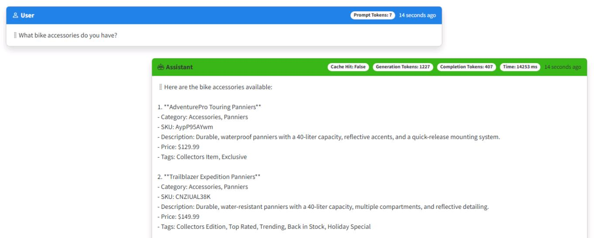
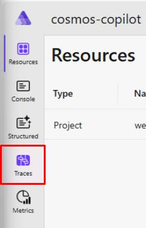
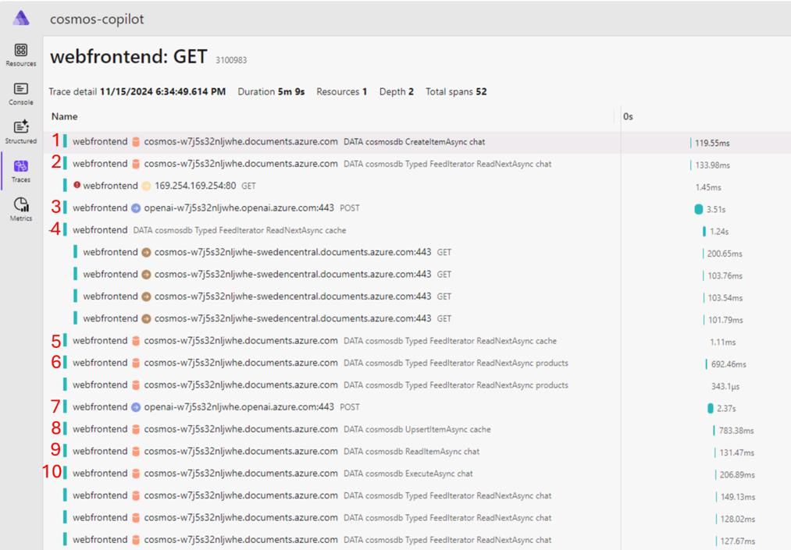
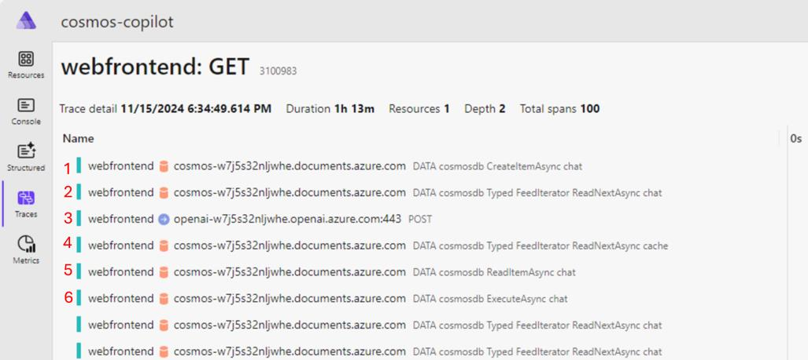
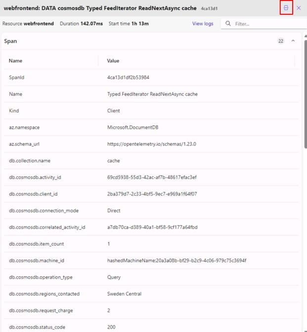
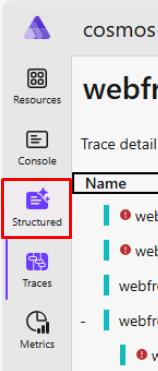
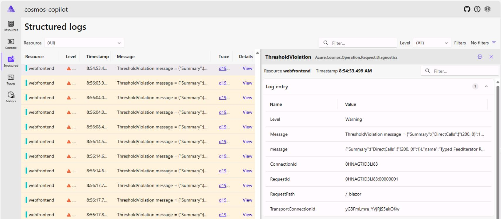

# Task 06: Explore the .NET Aspire dashboard

### Introduction
Real-time insights matter to CWBC. Suppose a new e-bike line launches and queries spike; the .NET Aspire Dashboard helps you spot performance bottlenecks, see which calls consume the most tokens, and confirm whether your cache is kicking in. It’s the command center for everything your Intelligent Assistant does.

The .NET Aspire dashboard is a great resource for monitoring your application in development. It helps you understand the request flow in your application and provides a centralized place for viewing traces and logs in real-time. 

So far, you've used the .NET Aspire dashboard to launch the web application. Let's explore the other features exposed in the dashboard.

### Description
In this task you will investigate how the Intelligent Assistant performs under the hood by using the .NET Aspire dashboard. You’ll observe real-time traces, monitor how requests flow to Azure Cosmos DB and Azure OpenAI, and identify when cache hits or vector searches occur. 

### Success Criteria
 - You can see real-time traces for each request (vector search, semantic cache, AI completion) in the dashboard.
 - You identify where requests spend the most time, confirm cache hits vs. misses, and observe any slow spans.
 - You understand how to use these metrics and logs to troubleshoot or optimize the Intelligent Assistant’s performance over time.


### Learning Resources
 - TBD

## Key Tasks


### 01: Analyze Real-Time Traces

<details markdown="block"> 
  <summary><strong>Expand this section to view the solution</strong></summary> 


1. Select **Create New Chat** on the left, then select the **New Chat** that was created.

1. Enter **What bike accessories do you have?**

    

1. Start another new chat session, and ask the same question: **What bike accessories do you have?** 

    {: .note }
    > You should get a cache hit with an immediate response consuming zero generation tokens.

1. Go to the .NET Aspire dashboard tab in the browser. 

1. Select **Traces** from the left toolbar. 

    

    {: .note }
    > You’ll see all the network requests in your application represented chronologically here. Notice there are several **GET** calls and a **POST** as the Blazor application starts up. 

1. Select the bottom trace to expand the service calls being made in the application. 

    

---

Each request made to Azure Cosmos DB or Azure OpenAI is represented as a span. The first few spans represent background tasks in the web application to query Azure Cosmos DB for existing chats and to verify the product data has been loaded. 

Each time a new container in Azure Cosmos DB is accessed, the SDK makes several HTTP requests to get metadata for the container. You’ll see these represented as child spans. Let's explore the spans in this dashboard and correlate them to the features you implemented so far in our chat application.

1. Scroll down in the list of traces. If you created a new chat session for this exercise, find the second **DATA cosmosdb CreateItemAsync chat** span (the first would be to create the chat session item itself). If you didn't create a new chat session, find the first **CreateItemAsync**. This is the call to store your first prompt in the Azure Cosmos DB chat container. 

    {: .note }
    > You may need to expand the **Name** column by selecting the vertical line to the left of the **0s** column and dragging it to the right. 

1. Since we haven't asked about bike accessories yet, this was a cache miss. Let's explore the request flow and validate it matches our expectations.

    

    Your traces should resemble the image above. If you see an error from *169.254.169.254:80*, this is a metadata request made by the SDK to get information about your compute environment. For unsupported VM types, this is expected to fail and is safe to ignore.

    1. First, there is a call to the Azure Cosmos DB chat container to store the prompt you typed in the chat.
    1. Next, the call to the chat container represents building the context window. We need to query for any previous messages in the chat session to get contextually relevant results.
    1. Then, this call to Azure OpenAI represents getting the vector embeddings from our prompt.
    1. This call to the cache container checks if we found a cache hit by passing in the vector embeddings and performing a vector search for similar responses. Notice there are child HTTP calls under this request. That is the SDK initializing connections for the cache container. The other containers had already been used earlier on in the application and therefore had already been initialized.
    1. This call represents a second round trip for the get cache query.
    1. Because we had a cache miss, next we queried for products relevant to the user prompt. This call uses vector search to find products from the products container to later pass to Azure OpenAI. The product data returned is the key component for implementing the RAG pattern.
    1. Next, we have the call to Azure OpenAI to get the chat completion for our prompt and RAG data. Notice the calls to Azure OpenAI have a higher duration than the rest of the calls, this is because we're sending a lot of context to the model to generate a completion.
    1. After generating a completion, we store the result in the cache to avoid having to compute a response for similar questions in the future.
    1. Then we call to retrieve the chat container item representing this chat session.
    1. Last, we execute a bulk upload of the chat completion and session to the chat container.

    {: .note }
    > This request flow maps to the LLM Pipeline we created in the **ChatService/GetChatCompletionAsync()** function.

1. Below the cache miss request flow, let's analyze the spans for the second prompt we gave. This time, we started another new chat session and entered the same question, generating a cache hit. You’ll notice the first three spans are the same, but because we had a cache hit, there are fewer steps.

    

    1. First, there’s a call to the Azure Cosmos DB chat container to store the prompt you typed in the chat.
    1. Next, the call to the chat container represents building the context window. We need to query for any previous messages in the chat session to get contextually relevant results.
    1. Then, this call to Azure OpenAI represents getting the vector embeddings from our prompt.
    1. This call to the cache container checks if we found a cache hit by passing in the vector embeddings and performing a vector search for similar responses. Because we've already made requests to the cache container in the previous chat, there are no child span initialization calls either.
    1. Then we call to retrieve the chat container item representing this chat session.
    1. Last, we execute a bulk upload of the chat completion and session to the chat container.

    {: .note }
    > This request flow also maps to the LLM Pipeline we created in the **ChatService/GetChatCompletionAsync()** function. Because we had a cache hit, we execute the code in the **if** statement that skips the calls to find relevant products and generate a completion from Azure OpenAI. Instead, we can return the cached completion to the user.

1. These traces and spans are emitted using OpenTelemetry, which is configured by default when you use .NET Aspire. Every SDK can provide custom OpenTelemetry attributes to add extra information to spans about the request. Azure Cosmos DB emits several custom attributes that can help you understand what's happening in your application. Select the fourth span from the previous step, which represents the query to the cache container. Optionally, select the icon to switch from horizontal to vertical view.

    

    {: .note }
    > Notice the **db.cosmosdb.item_count** with a value of **1**. This shows that we had one result returned from our query. Explore the other attributes provided and select spans for different operations to see the attributes provided for every request type.

1. Keep the .NET Aspire dashboard open and leave the application running, as you'll use it again in the next set of steps.

---

The Azure Cosmos DB SDK also emits logs through OpenTelemetry which appear in the .NET Aspire dashboard. Depending on the log level configured for your application, you can receive logs for errors and warnings. These logs are very helpful during application development to gain more information about failed or slow requests.

First, let's look at the log configuration for Azure Cosmos DB. 

1. Open the **src/cosmos-copilot.WebApp/`Program.cs** file. 

    

1. Find the **builder.AddAzureCosmosClient`()** function call, copied again here.

    ```csharp
    builder.AddAzureCosmosClient(    
        "cosmos-copilot",    
        settings =>    
        {        
            settings.AccountEndpoint = new Uri(cosmosEndpoint);        
            settings.Credential = new DefaultAzureCredential();        
            settings.DisableTracing = false;    
        },    
        clientOptions => 
        {        
            clientOptions.ApplicationName = "cosmos-copilot";        
            clientOptions.UseSystemTextJsonSerializerWithOptions = new JsonSerializerOptions()        
            {            
                PropertyNamingPolicy = JsonNamingPolicy.CamelCase        
            };        
            clientOptions.CosmosClientTelemetryOptions = new()        
            {            
                CosmosThresholdOptions = new()            
                {                
                    PointOperationLatencyThreshold = TimeSpan.FromMilliseconds(10),                
                    NonPointOperationLatencyThreshold = TimeSpan.FromMilliseconds(20)            
                }        
            };    
        });
    ```

    {: .note }
    > Notice the **clientOptions.CosmosClientTelemetryOptions** call. This is where threshold options are configured for emitting logs from Azure Cosmos DB requests. 
    
    >[!knowledge] There are separate configurations for **PointOperationLatencyThreshold** and **NonPointOperationLatencyThreshold** because requests interacting with a single item are frequently much lower latency than multi-item operations. These two thresholds are set extremely low in this application to ensure you have some logs to look at. 
    >
    >In a production application, you likely want to set this to a higher value to avoid having noisy logs for every request.

1. In the .NET Aspire dashboard, select **Structured** on the left menu. 

    

1. Select any of the warnings with a **ThresholdViolation**. 

    

    {: .note }
    > These represent requests that had higher latency than the thresholds you configured while creating our Cosmos client. The **Message** contains the Azure Cosmos DB diagnostic string with detailed information about the request.

</details>

---

# Summary

You’ve successfully implemented our new generative AI application using Azure Cosmos DB and Azure OpenAI Service. You’ve learned new concepts for building generative AI applications such as tokens, context windows, semantic caching, similarity scores, and RAG Pattern.

With the SDKs for Azure Cosmos DB for NoSQL and Semantic Kernel including its extensions and connectors, you were able to add these services to your application with little friction. The services you implemented illustrate the best practices for using each SDK across various operations. The .NET SDKs for each service made it possible to add the required functionality to your ASP.NET Core Blazor web application using .NET Aspire with lightweight method implementations.

---

## References

This hands on lab is available as a completed sample here, [Build a custom Copilot application.](https://github.com/AzureCosmosDB/cosmosdb-nosql-copilot)

Take some time to explore the services and capabilities you saw today to get more familiar with them.

- **Semantic Kernel**
  - [Get started with semantic kernel](https://learn.microsoft.com/semantic-kernel/overview/)
- **Azure Cosmos DB Vector Search**
  - [Get started with vector search in Azure Cosmos DB](https://aka.ms/CosmosDBVectorSetup)


Take your knowledge even further. We’ve built a complete end-to-end RAG Pattern solution that takes this lab you did today and expands it to a fully functional, production grade solution accelerator. The solution has the same ASP.NET Blazor web interface and the back end is entirely built using the latest features from Semantic Kernel. The solution can be deployed to either AKS or Azure Container Apps, along with a host of other services designed for deploying production grade applications in Azure.

- **Official Microsoft Solution Accelerator for building RAG pattern applications**
  - [Build your own Copilot Solution Accelerator](https://github.com/Azure/BuildYourOwnCopilot)


---

### Congratulations, you completed this task and the exercise!