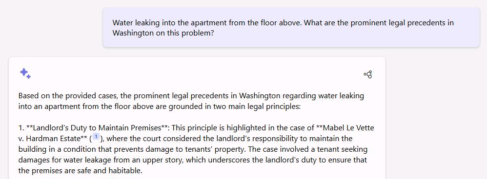
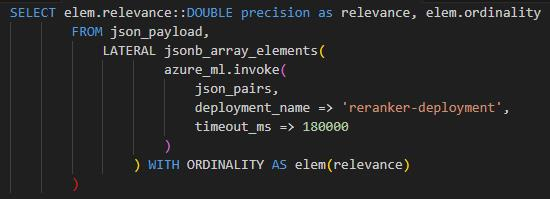
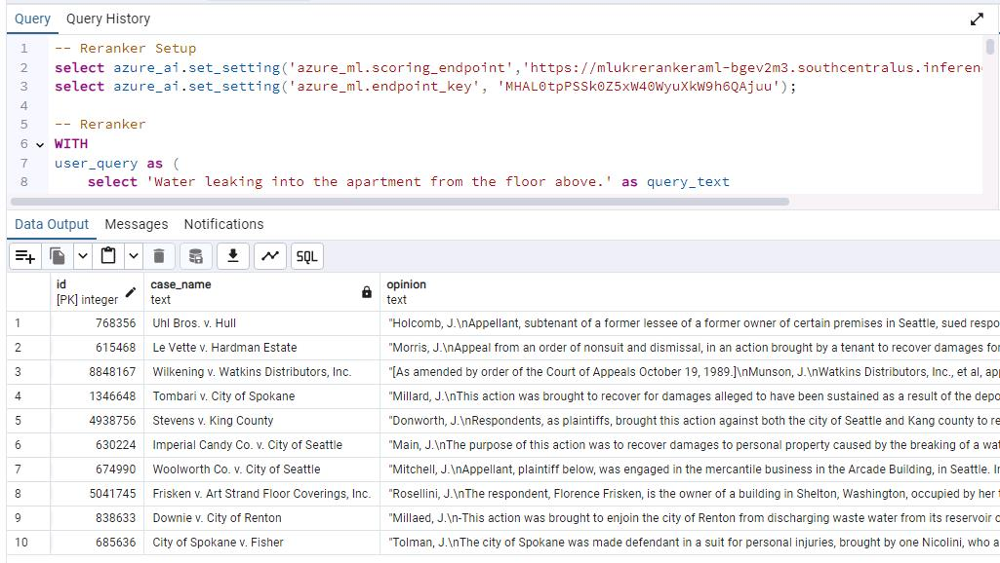
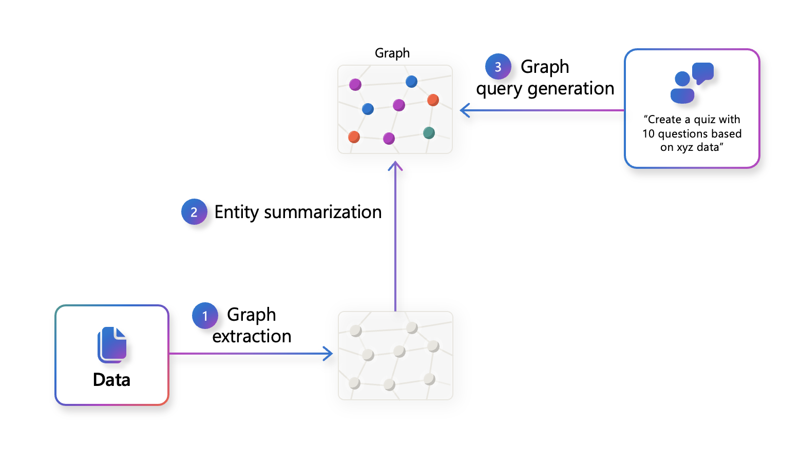
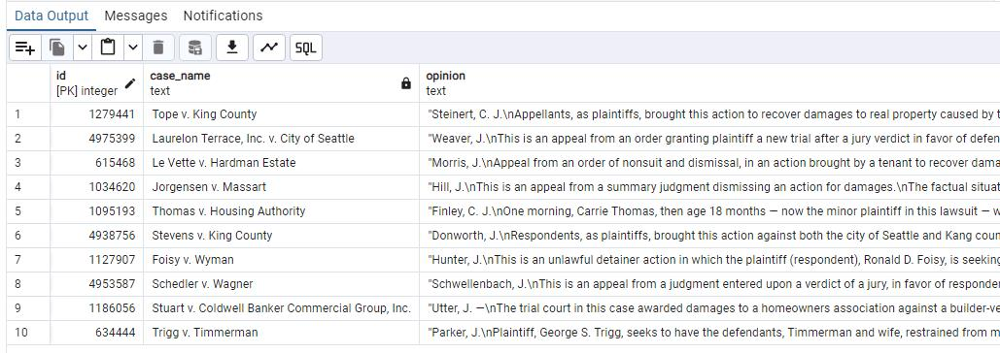

# Task 03: Improve RAG chatbot accuracy with different techniques

## Introduction
Retrieval-Augmented Generation (RAG) can provide more accurate chatbot responses by combining vector searches, improved ranking, and knowledge graph techniques. For the City of Metropolis, this helps officials handle complex inquiries by linking relevant data with large language models.

## What's RAG
The Retrieval-Augmented Generation (RAG) system is a sophisticated architecture designed to enhance user interactions through a seamless integration of various technological components. At its core, RAG is composed of:

 - Raw data source is chunked for embedding.
 - Data is embedded with OpenAI embedding model and saved in Postgres.
 - User can send in query from the application.
 - Query is embedding with OpenAI embedding model and vectorized for search.
 - Vector search on Postgres performed using the [pgvector extension](https://github.com/pgvector/pgvector).
 - Retrieved context is stored to be used in the prompt to an LLM (GPT 4o).
 - The prompt and the retrieved context is fed into an LLM (GPT 4o) for improved chat results.
 - The generated output is fed to the chat application.
 - The user sees the chat response.
 - All responses can be tracked for future evaluation.


## Description

In this task, you’ll run a query to test a RAG application. You’ll review vector search accuracy by examining the citation graph and retrieval rates, then improve RAG accuracy using advanced techniques like reranking and GraphRAG. You’ll understand and implement a reranker to enhance search result relevance, and use pgAdmin to execute and test reranking queries, optimizing AI capabilities within PostgreSQL. By improving the accuracy and relevance of search results, you contribute to more effective data retrieval and analysis, which is crucial for addressing complex metropolitan challenges such as traffic congestion, air pollution, and housing affordability.

## Success criteria

- You tested a RAG application to explore its limits.
- You reviewed a vector search for accuracy.
- You improved RAG accuracy by implementing reranking techniques and using the Semantic Ranker to aim for 60% retrieval of relevant cases.
- You implemented a reranker by opening pgAdmin, understood the reranker code snippet, and executed the reranker query to improve search result relevance.

## Learning resources

- [Improve AI accuracy and reliability with RAG](https://learn.microsoft.com/en-us/shows/generative-ai-with-javascript/improve-ai-accuracy-and-reliability-with-rag)
- [Augment LLMs with RAG and fine-tuning](https://learn.microsoft.com/en-us/azure/developer/ai/augment-llm-rag-fine-tuning)

## Key tasks

### 01: Explore a RAG application

 <details markdown="block"> 
  <summary><strong>Expand this section to view the solution</strong></summary> 

There's already a sample Legal Cases RAG application created so you can explore a RAG application. This application uses a **larger subset of legal cases data** than what you’ve explored in this lab, to provide more in-depth answers.

1. In a new browser tab, go to [https://abeomorogbe-graphra-ca.gentledune-632d42cd.eastus2.azurecontainerapps.io](https://abeomorogbe-graphra-ca.gentledune-632d42cd.eastus2.azurecontainerapps.io) to see our sample RAG application.

    

1. Select **Water leaking into the apartment** from the example queries.

    

    

    {: .note }
    > The RAG application uses the results from a vector search to answer your questions. 
    
1. Try any other query to test the limits of the application.

---

#### Review accuracy of vector search queries

For the sample question, 10 legal cases have been manually identified that'll produce the best answers. To explore the accuracy of vector search, follow these instructions:

1. Select the **Show graph** icon in the upper right of the prompt's response to see which cases were used to answer the question. 

    

1. On the **Citation Graph**, note that vector search only retrieved 40% of the most relevant cases. The orange indicates what was retrieved to answer the questions, and green indicates what should be retrieved for the sample question.

    
   
</details> 

### 02: Improve RAG accuracy with advanced techniques - Reranking and GraphRAG

 <details markdown="block"> 
  <summary><strong>Expand this section to view the solution</strong></summary> 

#### What's a reranker?

A reranker is a system or algorithm used to improve the relevance of search results. It takes an initial set of results generated by a primary search algorithm and reorders them based on additional criteria or more sophisticated models. The goal of reranking is to enhance the quality and relevance of the results presented to the user, often by leveraging machine learning models that consider various factors such as user behavior, contextual information, and advanced relevance scoring techniques.

{: .important }
> Read more about [Semantic Ranking for GenAI apps](https://aka.ms/semantic-ranker-solution-accelerator-pg-blog).


---

#### Understand the improved accuracy of semantic reranker

You’ll use the same example from the vector search example in the previous section. To explore the accuracy of the semantic reranker, follow these instructions:

1. On the RAG application, select **Semantic Ranker** on the top bar, then select **Clear** in the upper right to go back to the home screen.

    

1. Select the same **Water leaking into the apartment** query from the previous task.

1. Select the **Show graph** icon in the upper right of the prompt's response to see which cases were used to answer the question. 

    

1. On the **Citation Graph**, note the semantic reranker has an improved accuracy, retrieving 60% of the most relevant cases.

---

#### Implement a reranker for queries

1. Open the **pgAdmin** window for the following steps.

1. Before you execute the reranker query to improve the relevance of your search results, it’s important to understand the following snippet of code for reranking. 

    {: .warning }
    > Do not run this code, as it's solely for demonstration.

    

    {: .note }
    > The above snippet performs the following actions:
    - **azure_ml.invoke()** - Invokes the Azure Machine Learning service with the specified deployment name and timeout. [BGE model](https://huggingface.co/BAAI/bge-m3) is being used for reranker.
    - **jsonb_array_elements()** - Processes the JSON payload and extracts the relevance score and ordinality for each element to improve the relevance of search results.
    - **elem.relevance**- The relevance is used for reranking the results.

1. Select the **New query tool for current connection** button on the top of the query pane.

    There's a file created for you to test reranking. 

    

1. Select the **Open File** button.

    

1. Go to **C:\Users\LabUser\Downloads\mslearn-pg-ai\Setup\SQLScript**, select **reranker_query**, then select **Open** on the lower right.

1. Note that the API Key is currently empty on **Line 3**. Replace the line with the following:

    ```
    select azure_ai.set_setting('azure_ml.endpoint_key', 'MHAL0tpPSSk0Z5xW40WyuXkW9h6QAjuu');
    ```

1. Ensure no lines of text are highlighted in the code, then select the **Execute script** button on the top bar.

    The output will be similar to the following:

    

</details> 

### 03: Use GraphRAG to improve Q&A performance with knowledge graphs

 <details markdown="block"> 
  <summary><strong>Expand this section to view the solution</strong></summary> 
  
#### What's GraphRAG
  
GraphRAG uses knowledge graphs to provide substantial improvements in question-and-answer performance when reasoning about complex information. A knowledge graph is a structured representation of information that captures relationships between entities in a graph format. It’s used to integrate, manage, and query data from diverse sources, providing a unified view of interconnected data. 
For municipal operations, this approach helps identify dependencies or legal precedents across different agencies or departments.

[Apache Graph Extension](https://age.apache.org/age-manual/master/index.html) (AGE) is a PostgreSQL extension developed under the Apache Incubator project. AGE is designed to provide graph database functionality, enabling users to store and query graph data efficiently within PostgreSQL. 

{: .important }
> [Introducing the GraphRAG Solution for Azure Database for PostgreSQL](https://aka.ms/graphrag-legal-solution-accelerator-pg-blog).


---

#### Understand the improved accuracy of GraphRAG

Using the same example from the vector search example in the previous section, follow these instructions to explore the accuracy of the semantic reranker:

1. Open your browser back to the RAG application tab, or go to: [https://abeomorogbe-graphra-ca.gentledune-632d42cd.eastus2.azurecontainerapps.io](https://abeomorogbe-graphra-ca.gentledune-632d42cd.eastus2.azurecontainerapps.io)

1. Select **GraphRAG + Semantic Ranker** on the top bar, then select **Clear** in the upper right, if needed, to go back to the home screen.

    

1. Select **Water leaking into the apartment** from the example queries.

    

1. Select the **Show graph** icon in the upper right of the prompt's response to see which cases were used to answer the question. 

    

1. On the **Citation Graph**, note the semantic reranker has an improved accuracy, retrieving 70% of the most relevant cases.

---

#### Implement graph queries for GraphRAG

1. Open the **pgAdmin** window.

1. Before you execute the graph query to improve the relevance of your search results, it’s important to understand the following snippet of code for reranking.
    
    {: .warning }
    > Do not run this code, as it's solely for demonstration.

    

    {: .note }
    > This performs the following actions:
    > - Selects the **refs** (reference count) and **case_id** from the **graph** (created with [Apache Age extension](https://techcommunity.microsoft.com/blog/adforpostgresql/introducing-support-for-graph-data-in-azure-database-for-postgresql-preview/4275628)).
    - Selects all columns from the **semantic_ranked** table.
    - Performs a **LEFT JOIN** between **semantic_ranked** and the result of a Cypher query executed on the case_graph graph.
    - The Cypher query matches all relationships (**[r]**) and returns the case_id and the count of references (**refs**) for each node (**n**).
    - The join condition matches the **id** from **semantic_ranked** with the **case_id** from the Cypher query result, casting **case_id** to an integer.

    

1. Select the **New query tool for current connection** button on the top of the query pane. 

    Two files have been created for you to test graph queries. One to set up the graph and the other to run the query. 

    

1. Select the **Open File** button.

    

1. Go to **C:\Users\LabUser\Downloads\mslearn-pg-ai\Setup\SQLScript**, select **graph_setup**, then select **Open** on the lower right.

1. Select the **Execute script** button on the toolbar. 

1. Select the **New query tool for current connection** button again. 

1. Select **Open File**. 

1. In **C:\Users\LabUser\Downloads\mslearn-pg-ai\Setup\SQLScript**, select **graph_query**, then select **Open** on the lower right.

1. Select **Execute script**. 

{: .warning }
> If you receive an error in the output, try executing again.

The output will be similar to the following:



</details> 

### 04: Compare results of RAG responses using Vector search, Reranker or GraphRAG

 <details markdown="block"> 
  <summary><strong>Expand this section to view the solution</strong></summary> 

As you look through these results, consider the following aspects while comparing them:

- Accuracy: Which query returns more relevant results?
- Understandability: Which response is easier to comprehend and more user-friendly?

Evaluate which query approach yields more relevant results, factoring in accuracy, clarity, and user-friendliness. Determining the best method helps Metropolis optimize data retrieval and resolution workflows.

1. Open your browser back to the RAG application tab, or go to: [https://abeomorogbe-graphra-ca.gentledune-632d42cd.eastus2.azurecontainerapps.io](https://abeomorogbe-graphra-ca.gentledune-632d42cd.eastus2.azurecontainerapps.io)

1. Select **Vector** on the top bar, then select **Clear** in the upper right, if needed, to go back to the home screen.

1. Select **Water leaking into the apartment** from the example queries.

1. Select the **Show graph** icon in the upper right of the prompt's response to see which cases were used to answer the question. 

1. Repeat the steps for **Semantic Ranker** and **GraphRAG + Semantic Ranker** on the top bar.

As you implement more advanced techniques, you’ll get better accuracy for different scenarios. 

---

### Reference: Golden dataset

Top 10 most relevant cases for the query: 

 - "Water leaking into the apartment from the floor above. What are the prominent legal precedents from cases in Washington on this problem?"

|    id    |                       case_name                     |    
|:---------|:-------------------------------------------------------| 
| 1186056  | Stuart v. Coldwell Banker Commercial Group, Inc. | 
| 4975399  | Laurelon Terrace Inc v. City of Seattle | 
| 1034620  | Jorgensen v. Massart | 
| 1095193  | Thomas v. Housing Authority| 
| 1127907  | Foisy v. Wyman | 
| 1279441  | Tope v. King County | 
| 1186056  | Le Vette v. Hardman Estate | 
| 768356   | Martindale Clothing Co. v. Spokane & Eastern Trust Co | 
| 1086651  | Schedler v. Wagner | 
| 2601920  | Pappas v. Zerwoodis | 
---
### Conclusion
**Congratulations!** You've successfully completed this task and have completed the lab **Improve RAG chatbot accuracy with different techniques!**
</details> 
