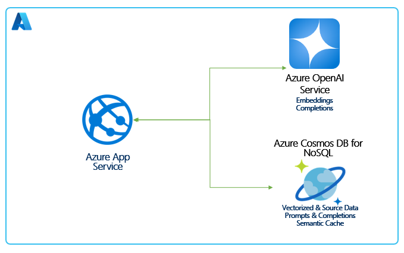
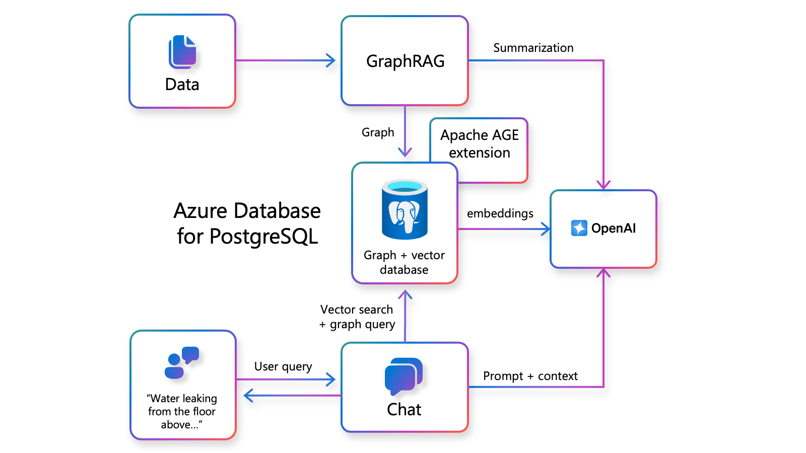

# TechExcel: Win the Database Platform

This lab is designed to help you develop advanced skills in database management and AI integration. You'll work with several key products, including Microsoft Azure Cosmos DB, Azure Database for PostgreSQL, and AI integration tools.

Azure Cosmos DB is a globally distributed, multi-model database service that offers high availability and low latency. It supports various data models and APIs, making it a versatile choice for modern applications. Azure Database for PostgreSQL is a managed database service that provides scalability, security, and high availability for PostgreSQL databases. It simplifies database management and allows for seamless migration from on-premises environments. AI integration tools enable you to incorporate AI capabilities into your databases, enhancing performance and providing intelligent insights.

In this lab, you'll build a serverless, AI-powered application using data from Azure Cosmos DB. You'll learn how to set up and configure Cosmos DB, integrate AI models, and create a serverless application that leverages these technologies. You'll also migrate an on-premises PostgreSQL server to Azure Database for PostgreSQL, guiding you through setting up the Azure environment, configuring the PostgreSQL server, and performing the migration to ensure a smooth transition to the cloud. Additionally, you'll integrate AI functionality into PostgreSQL by implementing AI models, integrating them with PostgreSQL, and optimizing queries to enhance database performance and provide intelligent insights.

By the end of this lab, you'll have hands-on experience with cloud-based database management, AI integration, and the skills to build and optimize modern, intelligent applications.

## Architecture

### Build a serverless, AI RAG application using data from Azure Cosmos DB

### Migrate an on-premises PostgreSQL server to Azure Database for PostgreSQL

### Integrate AI functionality into PostgreSQL

## Exercises

This lab has the following exercises:

 - Build a serverless, AI RAG application using data from Azure Cosmos DB 
 - Migrate an on-premises PostgreSQL server to Azure Database for PostgreSQL
 - Integrate AI functionality into PostgreSQL

The lab is available as GitHub pages here: [TechExcel: Win the Database Platform](https://microsoft.github.io/TechExcel-Win-the-Database-Platform/)

## Prerequisites

For running this lab you'll need:

**General requirements**
- Azure Subscription with required roles & quotas
- Microsoft Entra ID (Azure AD) for authentication
- Internet access and network security setup
- Azure Resource Requirements

For **Exercise 02: Build a serverless, AI RAG application using data from Azure Cosmos DB**:
- Azure Cosmos DB (NoSQL) with vector search
- Azure OpenAI for GPT-based chat
- .NET Aspire and AI orchestration

For **Exercise 03: Migrate an on-premises PostgreSQL server to Azure Database for PostgreSQL**:
- Azure PostgreSQL Flexible Server (v16)
- Azure Virtual Network and VPN Gateway
- Private DNS zone and SSL certificates for migration
- Visual Studio Code or Visual Studio 2022
- .NET SDK (8.0+), .NET Aspire
- Azure CLI and Azure Cosmos DB SDK
- pgAdmin 4 and PostgreSQL CLI
- Azure VPN Client and SSL certificates for migration

For **Exercise 04: Integrate AI functionality into PostgreSQL**:
- Azure PostgreSQL Flexible Server
- pgvector, azure_ai, and pg_diskann extensions
- Azure OpenAI integration for AI queries

